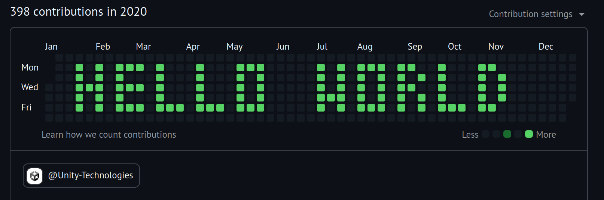
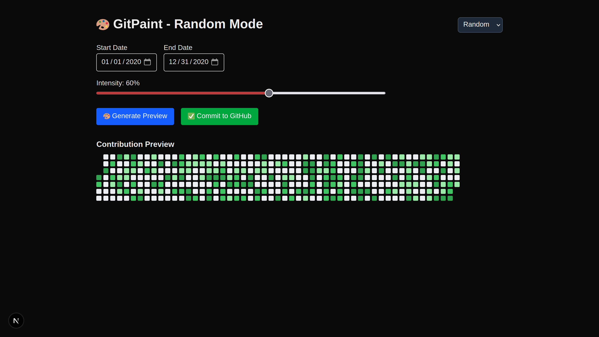
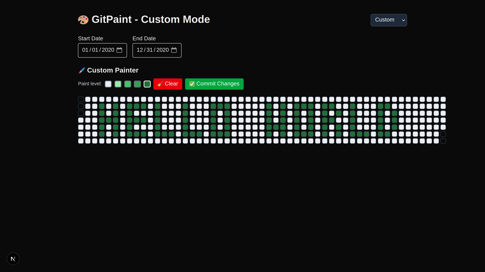

# 🎨 GitPaint

A fun tool to generate custom GitHub contribution graphs using real backdated Git commits. Supports both **random generation** and **custom painting** modes.





---

## 🚀 Features

- 🎲 **Random Mode** – Generate commits randomly with adjustable intensity
- 🖌️ **Custom Mode** – Paint your own pattern on the GitHub-style grid
- 📆 Custom date range selection
- 🟢 Real Git commits are made and backdated

---

## 🔧 Setup Instructions

### 1. Clone the repository

```bash
git clone https://github.com/armoredvortex/gitpaint.git
cd gitpaint
```

### 2. Install dependencies

```bash
npm install
```

### 3. Run the application

```bash
npm run dev
```

### 4. Open in your browser

Open `http://localhost:3000` in your web browser to start using GitPaint.

### 5. Create a private repository

Create a private repository on GitHub where you will push your commits. This is important to avoid cluttering your public profile with test data.

### 6. Push your changes

After generating your commits, you can push them to your private repository:

```bash
git push origin main
```

# Prerequisites

- Node.js (v14 or higher)
- npm (Node Package Manager)
- Git (for committing changes)
- A GitHub account (to push changes to your profile)

Made with ❤️ by Rachit.
